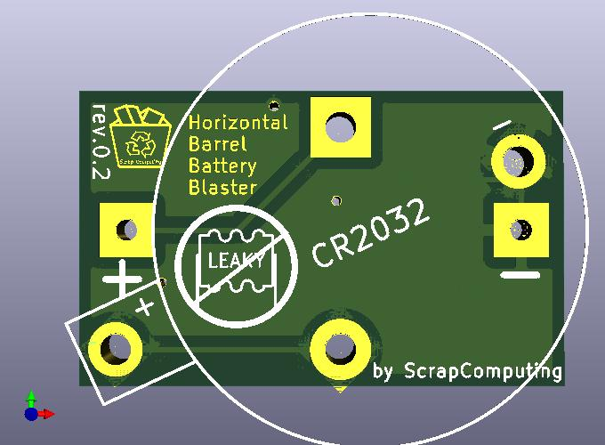
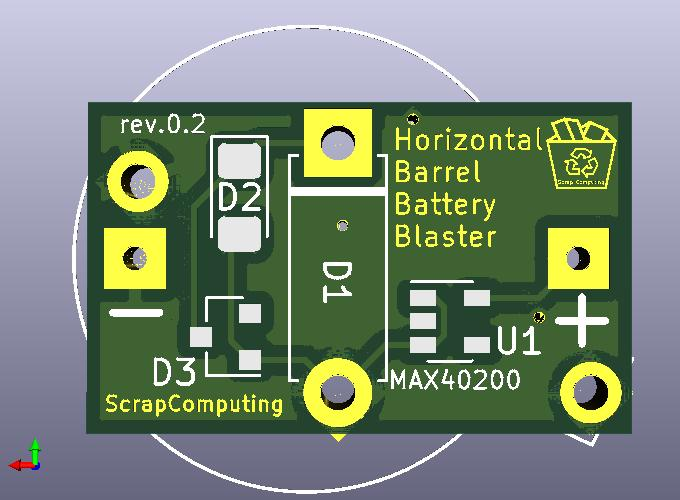
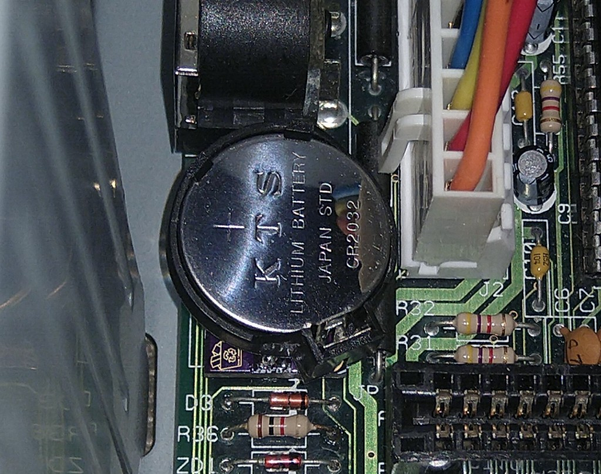

# Horizontal Barrel Battery Blaster

Horizontal Barrel Battery Blaster is a small PCB for replacing an old rechargeable barrel-type CMOS batteries with a non-rechargeable CR2032 Lithium battery.
Such barrel batteries were quite common on vintage computer motherboards up until the 486 era.
These barrel batteries tend to leak, damaging the motherboard and the surrounding components.

Unlike the [Barrel Battery Blaster](https://github.com/scrapcomputing/BarrelBatteryBlaster) and the [Vertical Battery Blaster](https://github.com/scrapcomputing/VerticalBarrelBatteryBlaster) this board sits horizontally on the motherboard.

> **Warning**
> There may not be enough clearance on your motherboard for this board and the CR2032 holder. So please check!

# Features
- Uses a standard through-hole CR2032 battery holder of the horizontal type
- Accepts 3 types of diode footprints: through-hole (e.g., 1N5817), 1206 and SOT23 ANK (e.g., BAS40-04)

# Video
https://www.youtube.com/watch?v=v_9UKSxLt-k

# Similar Projects
- [Vertical Battery Blaster](https://github.com/scrapcomputing/VerticalBarrelBatteryBlaster)
- [Barrel Battery Blaster](https://github.com/scrapcomputing/BarrelBatteryBlaster)

# How can I get one?

You can order one at your PCB fab of choice.
The simplest way is to use the zipped gerber file found in the [releases](https://github.com/scrapcomputing/HorizontalBarrelBatteryBlaster/releases).

# Bill of materials

Item                                             | #   | Description
-------------------------------------------------|-----|-----------------------------------------
Pins out of an male header (usually 2.54mm pitch)| 2   | For connecting the BarrelBatteryBlaster to the motherboard
Horizontally mounted CR2032 battery holder       | 1   | For the CR2032 Lithium battery
Diode (preferably Schottky)                      | 1   | Through-hole (e.g., 1N5817) or 1206 or SOT23 ANK (current flows pin1 -> pin3 like in BAS40 or BAS40-04)

